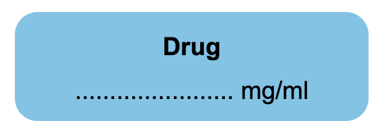

# drug-label

Vue component to provide UI drug labels as ```<drug-label>``` tags.

Usage demo on [Codepen](https://codepen.io/jplomas/pen/VwRYvrK/8f1c510e34642a5b615f3014f43879f1)

_docs a bit of a WIP_

## Parameters

### type

_Default: null (displayed as ```others``` / white label)_

Determines the type of drug and therefore the color of the label. Possible values are:

| Parameter | Type | Example | Colour |
|------|----|----|--------|
| ```induction-agent```  | Induction agents | thiopental | yellow |
| ```hypnotic``` | Sedative/hypnotics | midazolam | orange |
| ```hypnotic-antagonist``` | Sedative antagonist | flumazenil | orange and white stripes
| ```neuromuscular-blocker``` | Neuromuscular blockers | atracurium | fluorescent red |
| ```depolarizing-neuromuscular-blocker``` | Depolarising neuromuscular blockers | suxamethonium | fluorescent red with black top |
| ```neuromuscular-blocker-antagonist``` | Neuromuscular blocker reversal agents | neostigmine | fluorescent red and white stripes
| ```opioid``` | Opioids | fentanyl | blue |
| ```opioid-antagonist``` | Opioid antagonists | naloxone | blue and white stripes |
| ```vasopressor``` | Vasopressors | ephedrine | violet |
| ```adrenaline``` | Adrenaline | adrenaline | violet with black top |
| ```hypotensive``` | Hypotensive agents | labetalol | violet and white stripes |
| ```local-anaesthetic``` | Local anaesthetics | bupivacaine | grey |
| ```anticholinergic``` | Anticholinergics | atropine | green |
| ```antiemetic``` | Antiemetics | cyclizine | salmon |
| ```others``` | others drugs | paracetamol | white |

Example:



```html
<drug-label type="opioid" />
```

-----

### name

_Default: null (displayed as "Drug")_

The name of the drug to be displayed on the top portion of the label.  The initial letter is capitalized automatically.

Example:


```html
<drug-label name="ketamine" />
```

-----

### units

_Default: null (displayed as "mg/ml")_

-----

### size

_Default: null (displayed normal sized)_

Determines the size of the label. Possible values are:

| Parameter | Size | font-size |
|------|----|------|
| ```normal```  | Normal | 1.1rem |
| ```small``` | Small | 0.8rem |
| ```xsmall``` | Extra small | 0.6rem |

-----

### bordered

_Default: null (displayed as false - no border)_

| value | border |
|------|----|
| ```true```  | yes |
| ```false``` | none |

-----

### scaled
_Default: null (displayed as false)_

| value | width |
|------|----|
| ```true```  | 16 rem (size="normal")<br>12 rem (size="small")<br> 10 rem (size="xsmall")
| ```false``` | as parent element |

Example:


```html
<drug-label
  name="Midazolam"
  type="hypnotic"
  scaled
/>

<drug-label
  name="Midazolam"
  type="hypnotic"
  scaled
  size="small"
/>

<drug-label
  name="Midazolam"
  type="hypnotic"
  scaled
  size="xsmall"
/>
```
